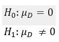
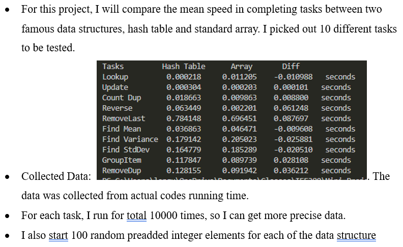
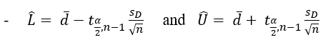
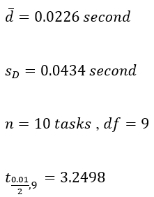

# Hypothesis-Test-on-Speeds-HashTable-and-Array

This is a simple speed comparison between Hash Table and Standard Array based on simple tasks

## Test explain:

- This is called Paired T Test, that test on the mean difference of a population, but two different treatments
- The main focus will be the mean speed in completing simple tasks
- 

## Data Collecting:

- 

## Define variables and Formula

- I will use 99% 2-sided Confidence Interval
- Formula: 
- Variables: 

## Conclusion:

- 
